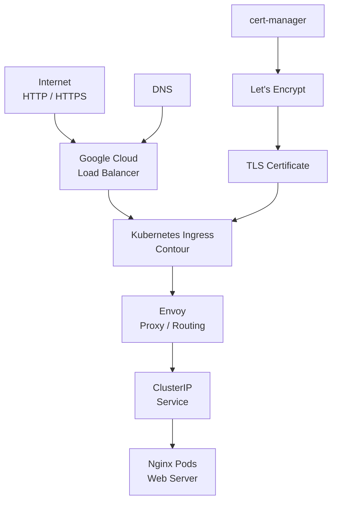
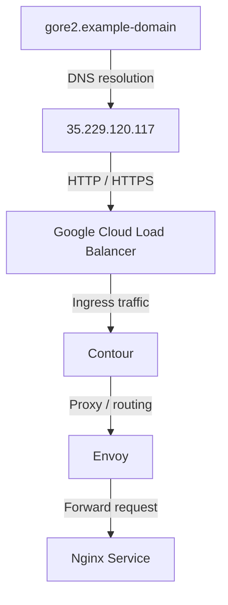
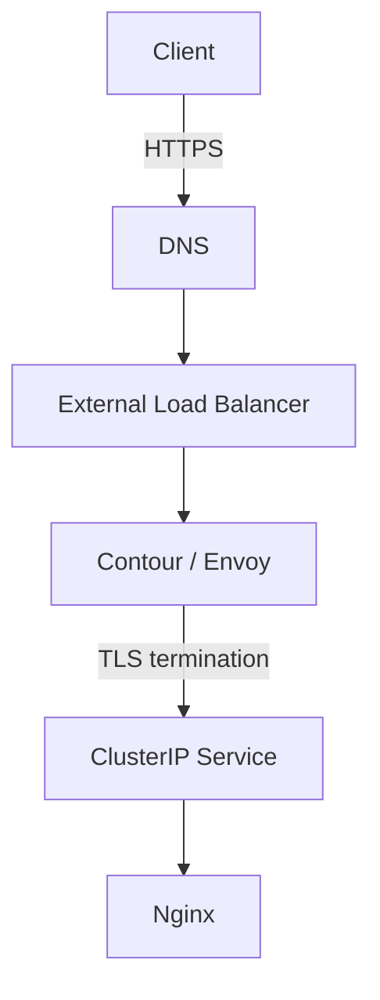
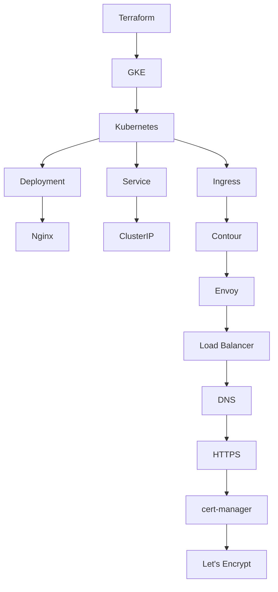

# Kubernetes Ingress: HTTP and HTTPS Traffic Management

A hands-on Kubernetes infrastructure project demonstrating how to expose a web application through Kubernetes Ingress, route HTTP/HTTPS traffic with Contour and Envoy, provision infrastructure with Terraform, configure DNS, and automate TLS certificates with cert-manager and Let's Encrypt.

The project was built and documented as a practical infrastructure walkthrough, with configuration files, terminal commands, Kubernetes resources, and runtime output used to verify each stage of the deployment.

Architecture



## What this project demonstrates

- Provisioning a Google Kubernetes Engine (GKE) cluster with Terraform
- Connecting to and validating a Kubernetes cluster with "gcloud" and "kubectl"
- Installing Contour as a Kubernetes Ingress controller
- Using Envoy as the data-plane proxy
- Deploying an Nginx web application
- Exposing the application internally with a "ClusterIP" Service
- Routing external traffic through an Ingress resource
- Assigning and validating an external load balancer IP
- Configuring DNS for the Ingress endpoint
- Installing cert-manager
- Issuing TLS certificates through Let's Encrypt
- Configuring HTTPS on the Ingress
- Verifying Kubernetes resources and certificate status from the command line

## Technology Stack

| Technology | Purpose |
|---|---|
| Kubernetes | Container orchestration |
| Google Kubernetes Engine (GKE) | Managed Kubernetes cluster |
| Terraform | Infrastructure provisioning |
| Contour | Kubernetes Ingress controller |
| Envoy | Layer 7 proxy and traffic routing |
| Nginx | Example web application |
| cert-manager | TLS certificate lifecycle management |
| Let's Encrypt | Certificate authority |
| DNS / DDNS | Domain-to-IP resolution |
| `kubectl` | Kubernetes administration |
| `gcloud` | Google Cloud authentication and cluster access |

## Project Structure

```bash
.
├── terraform/
│   ├── gke-cluster.tf
│   ├── variables.tf
│   └── ...
│
├── kubernetes/
│   ├── deployment.yaml
│   ├── service.yaml
│   ├── ingress.yaml
│   ├── ingress-updated.yaml
│   ├── letsencrypt-cm-issuer.yaml
│   └── certificate.yaml
│
└── README.md
```

---

## Deployment Flow

### 1. Provision the GKE Cluster

Terraform is used to define and provision the Google Kubernetes Engine infrastructure.

Initialize and validate the Terraform configuration:

terraform init
terraform validate
terraform fmt

Apply the configuration:

terraform apply

The infrastructure creates the Kubernetes environment required for the remainder of the deployment.

The original implementation also configured the cluster's service account and node pool through Terraform.

---

### 2. Connect to the Cluster

Authenticate with Google Cloud:

```bash
gcloud auth login
```

Retrieve the cluster credentials:

```bash
gcloud container clusters get-credentials <cluster_name> \
  --zone <zone_name> \
  --project <project_id>
```

Validate the connection:

```bash
kubectl get nodes -o wide
```

Example runtime output from the original deployment showed two GKE nodes in the "Ready" state:
```bash
NAME                                   STATUS   VERSION
gke-dev-cluster-gke-np-...             Ready    v1.30.3-gke.1639000
gke-dev-cluster-gke-np-...             Ready    v1.30.3-gke.1639000
```

This provides runtime evidence that the cluster was provisioned successfully and was accessible through `"kubectl".`

---

### 3. Install Contour

Contour is deployed as the Kubernetes Ingress controller.

```bash
kubectl apply -f contour.yaml
```

Verify the controller and Envoy workloads:

```bash
kubectl get pods -n projectcontour -o wide
```

The deployment produced Contour and Envoy workloads across the GKE nodes.

The runtime output included:

```bash
contour-...    1/1   Running
contour-...    1/1   Running
envoy-...      2/2   Running
envoy-...      2/2   Running
```

This verifies that both the control-plane components and Envoy proxy instances were running successfully.

---

### 4. Deploy the Nginx Application

The application uses Nginx.

Apply the deployment:

```bash
kubectl apply -f deployment.yaml
```

Create the Kubernetes Service:

```bash
kubectl apply -f service.yaml
```

The application is exposed internally through a "ClusterIP" Service:

```yaml
apiVersion: v1
kind: Service
metadata:
  name: gore-svc
spec:
  type: ClusterIP
  selector:
    app: gore
  ports:
    - port: 80
      protocol: TCP
      targetPort: 80
```

"ClusterIP" keeps the application service internal to the cluster. Contour/Envoy provides the external entry point and routes requests to this service.

Verify the service:

```bash
kubectl get services -o wide
```

Example:

```bash
NAME       TYPE        CLUSTER-IP      EXTERNAL-IP   PORT(S)
gore-svc   ClusterIP   34.118.238.166  <none>        80/TCP
```
---

### 5. Configure the Ingress

The Ingress resource connects the external traffic path to the internal application service.

Apply the configuration:

```bash
kubectl apply -f ingress.yaml
```

Verify the Ingress:

```bash
kubectl get ingress
```

Example output from the deployment:

```bash
NAME           CLASS     HOSTS   ADDRESS          PORTS
gore-ingress   contour   *       35.229.120.117   80,443
```

The external address is assigned to the load balancer managed by the Contour/Envoy deployment.

Inspect the Envoy service:

```bash
kubectl get -n projectcontour service envoy -o wide
```

Example:

```
NAME    TYPE           CLUSTER-IP      EXTERNAL-IP      PORT(S)
envoy   LoadBalancer   34.118.236.21   35.229.120.117   80:30899/TCP,443:31661/TCP
```

At this point, the application can be reached through the external load balancer address.

---

### 6. Configure DNS

The external load balancer IP needs to be associated with a domain name before HTTPS can be configured cleanly.

The original implementation used a DDNS provider to create a DNS record pointing to the external IP.

Conceptually:



Verify that the DNS record resolves to the external address before proceeding with certificate issuance.

---

### 7. Install cert-manager

Install cert-manager into the cluster:

```bash
kubectl apply -f cert-manager.yaml
```

Verify the cert-manager workloads:

```bash
kubectl get pods -n cert-manager
```

cert-manager manages the lifecycle of the TLS certificate and Kubernetes Secret used by the Ingress.

---

### 8. Configure Let's Encrypt

Create an Issuer for the Let's Encrypt production environment:

```yaml
apiVersion: cert-manager.io/v1
kind: Issuer
metadata:
  name: letsencrypt-production
spec:
  acme:
    server: https://acme-v02.api.letsencrypt.org/directory
    email: <your-email>
    privateKeySecretRef:
      name: letsencrypt-production
    solvers:
      - http01:
          ingress:
            name: gore-ingress
            ingressClassName: contour
```

Apply the configuration:

```bash
kubectl apply -f letsencrypt-cm-issuer.yaml
```

Verify the Issuer:

```bash
kubectl describe issuer letsencrypt-production
```

The original deployment returned:

```bash
Reason: ACMEAccountRegistered
Status: True
Type: Read
```

This confirms that the ACME account was successfully registered with Let's Encrypt.

---

### 9. Create the TLS Certificate

Create a Kubernetes "Certificate" resource:

```yaml
apiVersion: cert-manager.io/v1
kind: Certificate
metadata:
  name: gore-tls
spec:
  secretName: gore-tls
  issuerRef:
    name: letsencrypt-production
    kind: Issuer
  commonName: "your-domain.example"
  dnsNames:
    - "your-domain.example"
  usages:
    - digital signature
    - key encipherment
    - server auth
```

Apply it:

```bash
kubectl apply -f certificate.yaml
```

Verify the certificate:

```bash
kubectl describe certificate gore-tls
```

The original deployment reported:

```bash
Message: Certificate is up to date and has not expired
Reason:  Ready
Status:  True
Type:    Ready
```

The certificate resource also exposed its validity and renewal timestamps through Kubernetes status information.

---

### 10. Enable HTTPS on the Ingress

Update the Ingress configuration to reference the TLS Secret created by cert-manager.

Apply the updated configuration:

```bash
kubectl apply -f ingress-updated.yaml
```

Verify the Ingress:

```bash
kubectl get ingress
```

Expected structure:

```bash
NAME           CLASS     HOSTS                  ADDRESS          PORTS
gore-ingress   contour   your-domain.example    <external-ip>   80,443
```

At this stage, traffic follows the HTTPS path:


---

## Verification Checklist

The deployment was verified progressively rather than treating "terraform apply" or "kubectl apply" as proof of success.

## Infrastructure

- [x] GKE cluster provisioned with Terraform
- [x] Cluster credentials configured
- [x] Kubernetes nodes reachable
- [x] Nodes reported "Ready"

### Ingress

- [x] Contour installed
- [x] Envoy deployed
- [x] Envoy service exposed through a load balancer
- [x] Ingress resource created
- [x] External IP assigned

### Application

- [x] Nginx deployment created
- [x] "ClusterIP" service created
- [x] Ingress routed traffic to the application

### DNS

- [x] DNS record created
- [x] DNS mapped to the external load balancer address

### TLS

- [x] cert-manager installed
- [x] Let's Encrypt Issuer configured
- [x] ACME account registered
- [x] Certificate resource created
- [x] Certificate reported "Ready"
- [x] Ingress configured for HTTPS

---

## What I Learned

This project demonstrates the relationship between several infrastructure layers that are often documented independently:



The main takeaway is that Kubernetes Ingress is not an isolated resource. It sits inside a larger request path involving DNS, load balancing, ingress controllers, services, application workloads, and TLS infrastructure.

---

## Documentation Approach

This project was documented from the perspective of a developer following the deployment rather than simply describing Kubernetes concepts.

### The documentation includes:

- Prerequisites
- Explicit commands
- Configuration examples
- Expected runtime output
- Verification steps
- Failure/error handling
- Infrastructure dependencies
- Network flow
- TLS configuration
- Operational checks

The accompanying article also documents the actual command output from the deployment, including Kubernetes node state, Contour/Envoy workloads, load balancer assignment, and certificate status.

This makes the project both a technical implementation and a documentation sample.

---

Full Technical Walkthrough

Article:
How to Implement Kubernetes Ingress for HTTP and HTTPS Traffic Management

The article provides the detailed step-by-step walkthrough accompanying this repository.

Author

Victor Ehikioya Raeva

Technical Writer · Software Engineer

Focus areas:

- Developer documentation
- API documentation
- Kubernetes
- Cloud infrastructure
- Docs-as-Code
- OpenAPI
- Go
- AWS / GCP
- Terraform
- CI/CD
